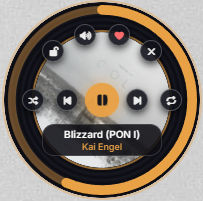
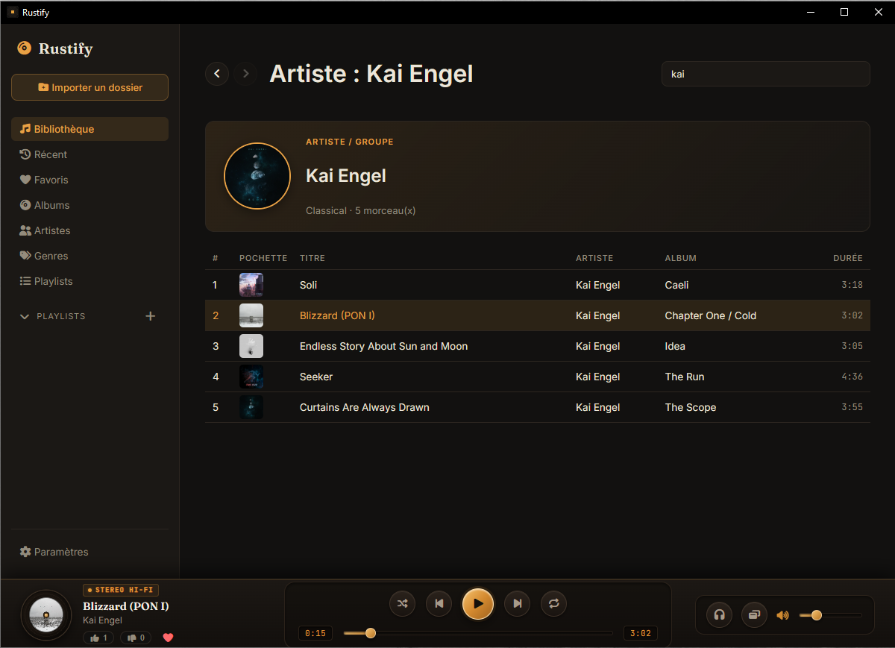
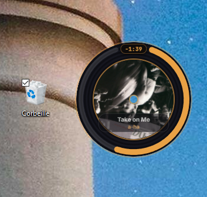

# Rustify — Lecteur de musique local (Tauri 2 / Rust)

**Rustify** est un lecteur de musique local performant et moderne construit avec **Tauri 2**, **Rust** (moteur audio `rodio`, métadonnées `lofty`, base de données `rusqlite`) et du **TypeScript** natif sans framework lourd.

---

## 📸 Aperçu & Captures d'écran

<div align="center">

### Interface principale


<br/>

### Détails & Éléments d'interface
| Lecteur / Vinyle | Pochettes & Vues |
| :---: | :---: |
|  |  |

</div>

---

## ✨ Fonctionnalités

### 🎵 Gestion de la Bibliothèque & Audio
- **Importation récursive** : Scan de dossier avec détection automatique (`.mp3`, `.flac`, `.wav`, `.ogg`, `.m4a`, `.aac`, `.opus`).
- **Métadonnées complètes** : Extraction via `lofty` (Titre, Artiste, Album, Genre, Année, Numéro de piste, Durée).
- **Pochettes d'album réelles** : Extraction native et mise en cache performante via IPC `read_cover`.
- **Moteur Audio Rust (`rodio`)** : Play, pause, reprise, stop, seek temporel précis, contrôle du volume et sélection du périphérique de sortie audio.
- **Gestion de la file de lecture** : Queue dynamique, modes répétition (*repeat*) et lecture aléatoire (*shuffle*).

### ⭐ Favoris & Statistiques d'Écoute
- **Favoris** : Marquage des pistes, albums et artistes préférés.
- **Statistiques détaillées** : Suivi des lectures (*play count*), skips (*skip count*), réactions (*likes / dislikes*) et durée totale / moyenne d'écoute par morceau.
- **Historique de lecture** : Traçabilité des dernières pistes jouées avec horodatage.
- **Playlists** : Création, gestion et lecture de listes personnalisées.

### 🛡️ Robustesse & Ergonomie
- **Instance unique (*Single Instance*)** : Prévention des lancements multiples simultanés.
- **Interface réactive** : Sidebar de navigation, animations (lecteur vinyle), barre de recherche instantanée et thématisation sombre aux accents ambre.

---

## 🛠️ Architecture

```
rustify/
├── src/                    # Frontend (Vite + TypeScript native — pas de framework)
│   ├── main.ts             # Logique UI, gestion d'état, IPC invoke()
│   └── style.css           # Thème sombre, accent ambre, animation vinyle
├── index.html              # Structure HTML5 sémantique
├── src-tauri/
│   ├── src/
│   │   ├── main.rs         # Point d'entrée Tauri, plugins & enregistrement des commandes
│   │   ├── state.rs        # AppState (Mutex<Connection>, Mutex<Player>)
│   │   ├── db.rs           # Schéma SQLite + CRUD (tracks, playlists, favorites, stats)
│   │   ├── scanner.rs      # Exploration de dossiers & extraction de tags (lofty)
│   │   ├── player.rs       # Moteur audio (rodio) sur thread dédié (Queue, seek, volume)
│   │   ├── commands.rs     # Interface IPC (Tauri commands)
│   │   └── models.rs       # Structures de données partagées (Serialize/Deserialize)
│   ├── capabilities/       # Configuration des permissions Tauri 2
│   ├── tauri.conf.json     # Configuration de l'application Tauri
│   └── Cargo.toml          # Dépendances Rust (rodio, lofty, rusqlite, tauri-plugin-single-instance...)
```

### Flux de données
`Frontend (TS)` ➔ `invoke()` ➔ `commands.rs` ➔ `AppState` ➔ `db.rs` (SQLite) / `player.rs` (rodio thread) ➔ `Result<T, String>`

---

## 🚀 Installation & Développement

### Prérequis
- **Rust** (`winget install Rustlang.Rustup`)
- **Node.js LTS** (`winget install OpenJS.NodeJS.LTS`)
- **Visual Studio Build Tools** (Workload "Desktop development with C++" pour Windows MSVC)

### Lancer en mode dev
```powershell
# Cloner le dépôt et se placer dans le projet
cd rustify

# Installer les dépendances frontend
npm install

# Démarrer l'application en mode développement
npm run tauri dev
```

### Compilation (Release)
```powershell
npm run tauri build
```

---

## 📝 Liste des fonctionnalités (Backlog)

### Phase 1 — MVP & Améliorations (Implémenté)
- [x] Scan et import récursif de la bibliothèque musicale.
- [x] Extraction des tags audio (`lofty`).
- [x] Base de données locale SQLite (`rusqlite` WAL mode).
- [x] Moteur audio Rust via thread dédié (`rodio`).
- [x] Extraction et affichage des pochettes d'albums (`read_cover`).
- [x] Système de favoris (Pistes, Albums, Artistes).
- [x] Statistiques d'écoute avancées & Historique.
- [x] Prévention multi-instances (*Single Instance*).
- [x] Sélection dynamique des périphériques audio.

### Phase 2 — Évolutions futures
- [ ] Auto-enchaînement via callbacks `sink` au lieu du polling.
- [ ] Synchronization bidirectionnelle du scan (détection/purge des fichiers supprimés avec confirmation).
- [ ] Surveillance multi-dossiers incrémentale (`mtime`).
- [ ] Reconstitution / Réordonnancement par Drag & Drop des playlists et de la queue.
- [ ] Raccourcis clavier globaux (Media Keys de l'OS).
- [ ] Égaliseur logiciel / Normalisation du volume (ReplayGain).

---

## 🔧 Correctifs majeurs & Choix techniques

### 1. Gestion Thread-safe du moteur audio (`cpal::Stream` non-Send)
- **Problème** : `rodio::OutputStream` utilise `cpal::platform::Stream` qui est `!Send`. Le placer directement dans `Mutex<Player>` bloquait la compilation Tauri (`E0277`).
- **Solution** : Le moteur audio est exécuté dans son propre thread dédié créé via `player::spawn_player_thread()`. Les commandes frontend communiquent via `Sender<PlayerCommand>` et lisent un état partagé `Arc<Mutex<PlayerState>>`.

### 2. Isolation du watcher Vite (`EBUSY` sur Windows)
- **Problème** : Chokidar (Vite) bloquait les DLLs verrouillées par Cargo dans `src-tauri/target/`.
- **Solution** : Ajout de `server.watch.ignored: ['**/src-tauri/**']` dans `vite.config.ts`.
